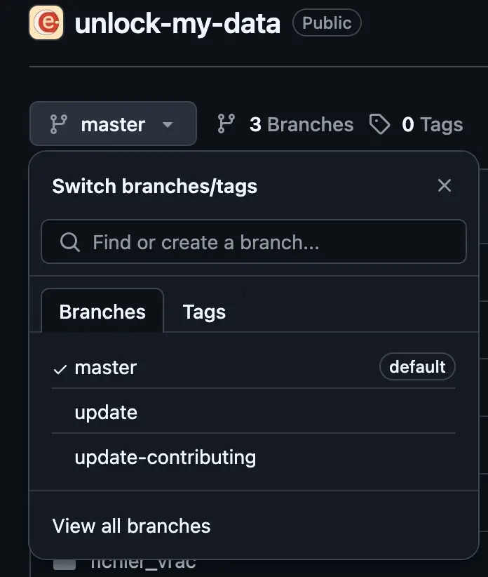
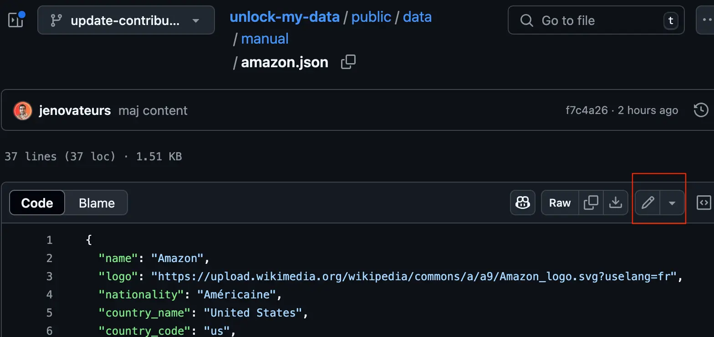
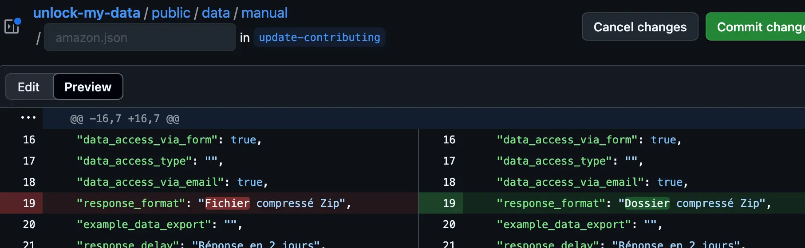
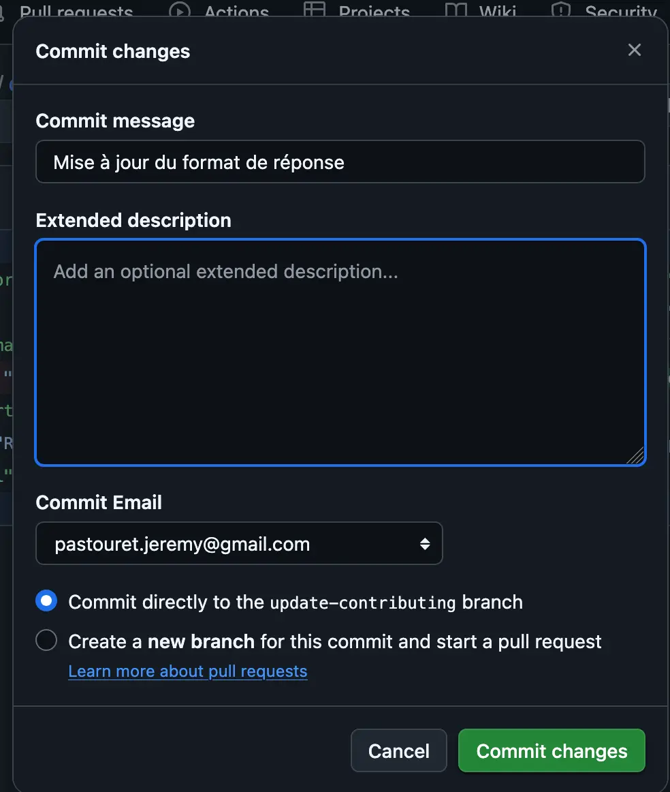

[🇬🇧 English](CONTRIBUTING.md) | [🇫🇷 Français](CONTRIBUTING_FR.md)

# Comment contribuer : Mettre à jour ou ajouter une fiche entreprise

Ce guide explique comment mettre à jour une fiche entreprise existante ou en ajouter une nouvelle dans le dépôt, en utilisant l’interface web de GitHub et la branche `update-contributing` (si vous êtes bénévole de l'association et qu'on vous a ajouté à l'équipe). Sinon il faut passer par le système de fork/pull request.

## 1. Comprendre le fichier fiche d’entreprise

Chaque fiche d’entreprise est un fichier JSON situé dans `public/data/manual/[nom].json`, où `[nom]` est le nom de l’entreprise (ex. : `amazon.json`).  
Voici la liste des champs et leur explication :

| Champ | Description |
|-------|-------------|
| `name` | Nom de l’entreprise. |
| `logo` | URL du logo de l’entreprise. |
| `nationality` | Nationalité de l’entreprise (ex. : `Américaine`). |
| `country_name` | Pays où se trouve le siège de l’entreprise. |
| `country_code` | Code pays ISO (ex. : `us`). |
| `belongs_to_group` | Booléen : l’entreprise appartient-elle à un groupe ? (`true` ou `false`) |
| `group_name` | Nom du groupe parent, si applicable. |
| `Applications` | Principaux services ou applications de l’entreprise. |
| `permissions` | Permissions d’accès aux données demandées ou accordées. |
| `contact_mail_export` | Adresse email pour les demandes d’export de données. |
| `easy_access_data` | Infos concernant un accès facilité aux données, si existant. |
| `need_id_card` | Booléen : une carte d’identité est-elle requise pour les demandes ? |
| `details_required_documents` | Détails sur les documents nécessaires pour l’accès aux données. |
| `data_access_via_postal` | Booléen : l’accès aux données est-il possible par courrier postal ? |
| `data_access_via_form` | Booléen : l’accès aux données est-il possible via un formulaire en ligne ? |
| `data_access_type` | Détails sur le type d’accès aux données (si non couvert ci-dessus). |
| `data_access_via_email` | Booléen : l’accès aux données est-il possible par email ? |
| `response_format` | Format de la réponse (fichier, zip, PDF, etc.). |
| `example_data_export` | Exemple d’export de données, si disponible. |
| `response_delay` | Délai de réponse habituel (ex. : `Réponse en 2 jours`). |
| `sanctioned_by_cnil` | Booléen : l’entreprise a-t-elle été sanctionnée par la CNIL ? |
| `sanction_details` | Détails et références aux sanctions de la CNIL. |
| `data_transfer_policy` | Booléen : l’entreprise a-t-elle une politique de transfert de données ? |
| `privacy_policy_quote` | Citation pertinente de la politique de confidentialité. |
| `transfer_destination_countries` | Liste des pays vers lesquels les données peuvent être transférées. |
| `outside_eu_storage` | Les données personnelles sont-elles stockées hors UE ? |
| `comments` | Commentaires supplémentaires. |
| `created_at` | Date de création de la fiche. |
| `created_by` | Auteur de la fiche. |
| `updated_at` | Date de la dernière mise à jour. |
| `updated_by` | Auteur de la dernière mise à jour. |
| `app` | (Objet optionnel) Détails de l’application : `{ "name": "...", "link": "..." }` |

---

## 2. Modifier une fiche existante

1. **Aller sur le dépôt sur GitHub**  
   Ouvrez le dépôt puis sélectionnez la branche `update-contributing` grâce au sélecteur de branches.

   

2. **Naviguer dans le dossier des fiches**  
   Allez dans `public/data/manual/`.

3. **Trouver et sélectionner le fichier**  
   Cliquez sur le fichier JSON à modifier (par exemple, `amazon.json`).

4. **Modifier le fichier**  
   Cliquez sur l’icône crayon (✏️) (“Modifier ce fichier”).


   
   
   
   Faites vos modifications en suivant les explications des champs ci-dessus.

5. **Vérifier les modifications**  
   - Cliquer sur le bouton "Preview changes" pour voir un aperçu de vos modifications.

   

6. **Enregistrer les modifications (commit)**
   - Appuyez sur le bouton "Commit changes".
   - Ajoutez un message de commit bref et descriptif (ex. : "Mise à jour de l’email de contact Amazon").
   - Vérifiez que "Valider directement sur la branche update-contributing" est sélectionné.
   - Cliquez sur "Commit changes".

   


---

## 3. Ajouter une nouvelle fiche entreprise

1. **Aller dans le dossier `public/data/manual/`**  
   Sur la branche `update-contributing`, allez dans ce dossier.

2. **Créer un nouveau fichier**
   - Cliquez sur le bouton “Add file” > “Create new file”.
   - Nommez votre fichier `[nomentreprise].json` (tout en minuscules; ex. : `newcompany.json`).

3. **Utiliser le squelette de fiche**  
   Copiez-collez ce modèle dans votre nouveau fichier et remplissez les champs :

   ```json
   {
     "name": "",
     "logo": "",
     "nationality": "",
     "country_name": "",
     "country_code": "",
     "belongs_to_group": false,
     "group_name": "",
     "Applications": "",
     "permissions": "",
     "contact_mail_export": "",
     "easy_access_data": "",
     "need_id_card": false,
     "details_required_documents": "",
     "data_access_via_postal": false,
     "data_access_via_form": false,
     "data_access_type": "",
     "data_access_via_email": false,
     "response_format": "",
     "example_data_export": "",
     "response_delay": "",
     "sanctioned_by_cnil": false,
     "sanction_details": "",
     "data_transfer_policy": false,
     "privacy_policy_quote": "",
     "transfer_destination_countries": "",
     "outside_eu_storage": "",
     "comments": "",
     "created_at": "",
     "created_by": "",
     "updated_at": "",
     "updated_by": "",
     "app": {
       "name": "",
       "link": ""
     }
   }
   ```
   Remplissez chaque champ aussi complètement que possible.

4. **Valider le nouveau fichier (commit)**  
   Comme précédemment, ajoutez un message de commit descriptif et validez directement sur la branche `update-contributing`.

5. **Mettre à jour le fichier `slugs.json`**
   - Allez dans `public/data/manual/slugs.json`.
   - Ajoutez le slug (nom du fichier sans `.json`) de votre nouvelle entreprise à la liste ou à l’objet, selon le format.
   - Validez votre modification.

---

## 4. Étapes finales

- Après vos modifications, vous pouvez créer une Pull Request de la branche `update-contributing` vers la branche principale (main).
- Écrivez un résumé indiquant ce que vous avez mis à jour ou ajouté pour faciliter la revue.

**Merci pour votre contribution !**